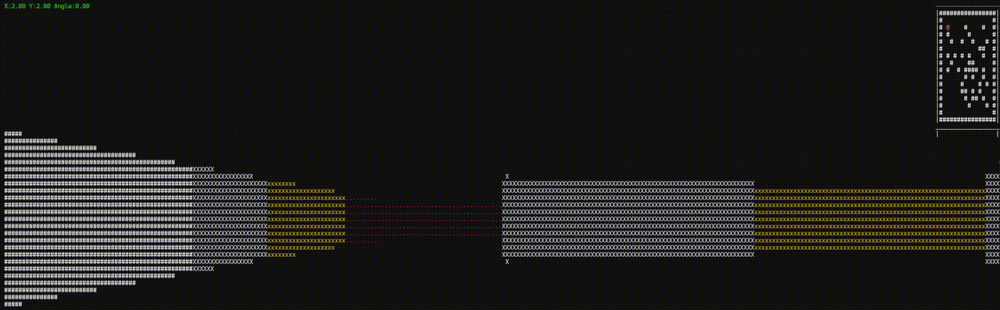

# AndEngine
This is a lightweight `2.5D` (*pseudo-3D*) game engine inspired by really old (classic!) games like Doom. The engine uses raycasting techniques to create pseudo-3D environments from 2D maps, providing an authentic retro gaming experience.

Current stage:

## Сontent
The brief of document links
1. [Controls and Quick Start](#-controls-in-current-realization)
2. [Current Game Feautures](#current-status-and-features)
    - [Completed Features and TechStack](#-completed-features)
    - [Previous WinAPI projects](#another-previous-winapi-projects-you-can-open-from-here)
3. [Feature Plans (roadmap)](#-roadmap)
4. [Technical Details (realization)](#-technical-details)
5. [Goals](#-technical-details)
6. [Contributing](#-technical-details)

---

## 🎮 Controls in current realization
- `W/S` - Move forward/backward
- `A/D` - Rotate left/right
- `ESC` - Exit (stop rendering)

## Quick Start (Current WinConsole Version)
In the current version used `Visual Studio 2022`, you can clone/download this repository and build the project for `Windows`. Run with `.exe`... you know

## Current status and features

### ✅ Completed Features
- **Raycasting Renderer**: Core rendering system using raycasting algorithm
  - Console-based visualization with ASCII art
  - Real-time 3D perspective from 2D maps
  - Distance-based wall shading
  - Fish-eye distortion correction
- **Basic Input System**: WASD movement and mouse/keyboard camera rotation
- **Map System**: Grid-based level representation
- **Mini-map**: Real-time overhead view for debugging and navigation

### 🔧 Technical Stack
- **Language**: C++14
- **Platform**: Windows (`WinAPI`)
- **Rendering**: Console-based (ASCII)
  > planned migration to SDL2/OpenGL

#### Another (*previous*) `WinAPI` projects you can open from here:

## 📋 Roadmap
> This is a rough draft of the plan, the stages can change and be adjusted depending on the work done or planned.

### Phase 1: Core Engine (Current)
- [x] Raycasting renderer
- [x] Basic player movement
- [x] Simple map loading
- [ ] Enhanced map structure with tile properties
- [ ] Collision detection system

### Phase 2: Graphics Enhancement
- [ ] SDL2 integration
- [ ] Texture mapping for walls
- [ ] Sprite rendering
- [ ] Lighting system
- [ ] Particle effects

### Phase 3: Game Objects
- [ ] Entity system
- [ ] Player class with health, ammo
- [ ] Primitive enemy AI
- [ ] Weapon system
- [ ] Pickups

### Phase 4: Audio & Effects
- [ ] Sound effects and music
- [ ] Visual & screen effects

### Phase 5: Level System
- [ ] Level loader/editor
- [ ] Multiple floor heights
- [ ] Interactive objects (doors, switches)
- [ ] Scripting system

### Phase 6: Shooter Implementation
- [ ] Complete Doom-like shooter game
- [ ] Multiple weapon types
- [ ] Enemy variants
- [ ] Power-ups and secrets
- [ ] HUD and UI system

## 📚 Technical Details

### Raycasting Algorithm
The engine uses a step-based raycasting algorithm:
1. Cast rays from player position at different angles
2. Step along each ray until hitting a wall
3. Calculate wall height based on distance
4. Apply fish-eye correction
5. Render column with distance-based shading

## 🎯 Goals
- **Educational**: Learn game engine development from scratch with `C/C++`
- **Retro**: Recreate the magic of classic pseudo-3D games
- **Modular**: Build reusable engine components
- **Fun**: Create an enjoyable shooter experience!!!!!!1!!!1!

## 🤝 Contributing
This is currently just my personal learning project, but suggestions and feedback are welcome!

---

*"In the beginning, there was darkness. Then someone cast a ray."* 🔦
